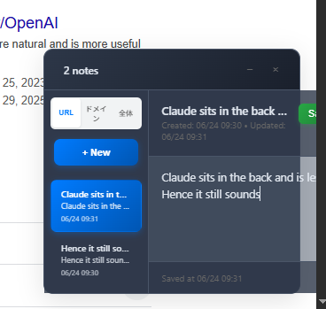

# ⭐ URL Note Taker ⭐

### 🚀 このプロジェクトが役に立ったら、ぜひスターをお願いします！ 🚀

A modern userscript for taking notes on any webpage with an intuitive Preact-based interface.

📝 **[日本語版はこちら](README.ja.md)** | **[⭐ Star this repo](https://github.com/URL-Note-Taker/core)**

**💡 Like this project? Consider giving us a star ⭐ to show your support!**

## Features

- 📝 **Per-page Note Management** - Create and manage notes for each URL
- 🌐 **Domain-based View** - Display notes from the same domain collectively  
- 📊 **Global View** - Integrated display of notes from all sites
- 💾 **Auto-save** - Real-time automatic note saving
- ⌨️ **Keyboard Shortcuts** - Toggle visibility with Shift+N
- 🎨 **Dark Mode Support** - Automatically follows system preferences
- 📱 **Responsive Design** - Adapts to various screen sizes

## 🚀 Quick Start (1 minute setup!)

### ⭐ Star this repo first, then follow these simple steps:

1. **Install a userscript manager**
   - [Tampermonkey](https://www.tampermonkey.net/) (recommended)
   - [Greasemonkey](https://www.greasespot.net/)
   - [Violentmonkey](https://violentmonkey.github.io/)

2. **Install the script**
   - **One-click install**: [main.user.js](main.user.js)
   - Your userscript manager will open automatically

3. **⭐ Star this repository** to support the project!

## Usage

1. **Launch**: Press `Shift + N` to show/hide the note panel
2. **Create**: Click the "+ New" button to create a note
3. **Edit**: Click on existing notes to edit them
4. **Save**: Auto-saves automatically, or press `Ctrl + S` for manual save
5. **Switch Views**: Toggle between URL/Domain/Global note displays

## Keyboard Shortcuts

- `Shift + N`: Toggle panel visibility
- `Ctrl + S`: Save note
- `ESC`: Minimize panel

## Browser Support

- ✅ Chrome/Chromium 80+
- ✅ Firefox 75+
- ✅ Safari 13+
- ✅ Edge 80+

## 🤝 Contributing

Contributions are welcome! Help us make this project even better:

1. **⭐ Star this repository**
2. **🍴 Fork the project**
3. **🔧 Create your feature branch**
4. **📝 Commit your changes**
5. **📤 Push to the branch**
6. **🎯 Open a Pull Request**

Please see [CONTRIBUTING.md](CONTRIBUTING.md) for details.

## 💪 Support the Project

**Multiple ways to support and grow our community:**

### 🌟 Free Support
- ⭐ **Star this repository** - Show your appreciation!
- 🍴 **Fork & Share** - Help others discover this project
- 🐦 **Share on social media** - Spread the word
- 📝 **Write a review** - Tell others about your experience

### 🤝 Community Participation  
- 🐛 **Report Bugs**: [Issues](../../issues)
- 💡 **Request Features**: [Discussions](../../discussions)
- 📖 **Improve Documentation**: [Wiki](../../wiki)
- 🔧 **Contribute Code**: Submit pull requests
- 💬 **Join Discussions**: Help other users

### 💝 Financial Support
- 💖 **GitHub Sponsors**: [Sponsor @yuis-ice](https://github.com/sponsors/yuis-ice)
- ☕ **Ko-fi Monthly**: [Join exclusive supporters](https://ko-fi.com/aiops)
  - 🌟 **Early Adopter Benefits** - Limited time tier for early supporters
  - 🎯 **Future Premium Tiers** - Early supporters get priority access to higher-tier benefits
- 🏆 **Become a patron**: Support ongoing development

### 📢 Share & Promote
- 🔗 **Share this repo**: `https://github.com/URL-Note-Taker/core`
- 📱 **Social Media**: Tag us `@yuis-ice`
- 📝 **Blog about it**: Write about your experience
- 🎥 **Create tutorials**: Help others learn to use it

## 📈 Project Stats

## License

MIT License - see the [LICENSE](LICENSE) file for details.

---

### 🌟 Join Our Growing Community! 🌟

**Thank you for being part of the URL Note Taker community!**

- 📊 **Repository**: https://github.com/URL-Note-Taker/core
- 🌐 **Website**: [Coming Soon]
- 📧 **Contact**: Open an issue or start a discussion
- 🤝 **Contribute**: Every contribution matters, no matter how small!

**Made with ❤️ by [@yuis-ice](https://github.com/yuis-ice) and the community**